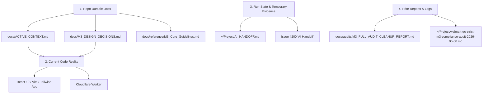

# Documentation, Branch, and Artifact Coherence Audit
**Date:** July 1, 2026  
**Repository:** `dotsthewarlock/Walmart-GC`  
**Active Branch:** `features/fix-2026-07-01` (points to `main` at `d4e9c30`)  
**Target File:** `docs/reports/DOCS_COHERENCE_AUDIT_2026-07-01.md`  

---

## 1. Executive Summary

This audit assesses the alignment and coherence of the repository documentation, git branches, and local project artifacts of `dotsthewarlock/Walmart-GC` against current code reality and strict Material 3 design decisions. 

The repository is in an **exceptionally cohesive and stable state**. Following the successful merger of PR #203, PR #204, and PR #205 between June 30 and July 1, 2026, the core codebase (React 19 + Vite + Tailwind CSS static app + Cloudflare Worker) achieves **100% adherence** to the established [M3_DESIGN_DECISIONS.md](docs/M3_DESIGN_DECISIONS.md).

All high-importance issues flagged in the previous June 30 visual audit have been **completely resolved**:
1. **Hardcoded Git Branch:** Misleading telemetry (`agy/shadcn-refactor-docs`) in the System Status card has been removed.
2. **Tabular Balances:** Card row current balance amounts now correctly carry `font-mono` to prevent layout drift on column alignment.
3. **Spotlight Scrim:** The heavy `bg-black/60` modal overlay has been replaced with a premium M3-conforming light tonal overlay (`bg-m3-on-surface/10`).
4. **Barcode Background Leak:** The white background leak has been fixed. The barcode container now renders as a smaller, styled inset at rest (`bg-m3-surface-container`) and expands smoothly into a scan-safe container when focused.
5. **Dark Mode Integration:** Standard M3 dark theme custom properties have been fully defined in `src/index.css` and a theme selector ("Appearance" drop-down) has been integrated into Settings.
6. **Backup Controls:** The Backup & CSV details block is now collapsed by default to streamline cognitive density.
7. **Stale Root Files:** Stale legacy static files `app.js` and `styles.css` have been moved to `docs/archive/legacy-code/`.

### Key Finding:
While the code matches the documentation perfectly, the repository is carrying **significant git and artifact overhead**:
- **Branch Clutter:** There is an extensive collection of local (13) and remote (23) branches, mostly comprised of local backups created around July 1, 2026, and stale historical phase branches.
- **Documentation Name Collision:** Having an `AI_HANDOFF.md` in `docs/archive/` alongside the active `/home/godfreymiu/Project/AI_HANDOFF.md` causes text search noise and developer confusion.
- **Out-of-Repo Duplication:** Several key guidelines and dossiers are duplicated as raw files directly in `/home/godfreymiu/Project/`, leading to secondary copies outside of git version control.
- **Stale Active Context in AGENTS.md:** The root-level instructions in `AGENTS.md` still state that React/Vite is a "production-candidate target" for "tomorrow's planned work," which is obsolete now that the React/Vite deploy is fully live and verified.

Implementing the recommended safe, doc-only cleanup and pruning stale branches will finalize the transition to a premium, maintainable codebase.

---

## 2. Source-of-Truth Map

The repository operates on a strict **Authority Order** to ensure alignment across multiple development interfaces:

### Protocol for Developers and Agents:
1. **Durable Rules & Context (Order 1):** Always read [ACTIVE_CONTEXT.md](docs/ACTIVE_CONTEXT.md) and [M3_DESIGN_DECISIONS.md](docs/M3_DESIGN_DECISIONS.md) before writing any code. All long-term systems rules, deployment boundaries, and UI designs belong here.
2. **Current Code Reality (Order 2):** Current code structure (`src/App.jsx`, `src/index.css`, `vite.config.mjs`) is the absolute mechanical truth. If a durable doc conflicts with live code, the code must be aligned to the durable doc (never vice versa, unless explicitly authorized).
3. **Run-State Logs (Order 3):** `AI_HANDOFF.md` and Issue #200 are **transient**. They are used only for handoffs between sessions and do not represent durable repo rules. Do not add permanent rules here.
4. **Historical Evidence (Order 4):** Archived files and prior reports are referenced strictly as background context. They must never override active docs or current code reality.

---

## 3. Stale / Conflicting Docs

The following documentation files contain stale information that conflicts with current repository reality:

| File Path | Location / Line | Conflict Details | Recommended Action |
| :--- | :--- | :--- | :--- |
| [AGENTS.md](`AGENTS.md`) | `L91-92` | States that React/Vite is a "production-candidate target" and "tomorrow's planned work." This is obsolete; the React/Vite build on `main` is verified live. | Update to confirm that React 19 + Vite + Tailwind CSS is the active live deployment. |
| [AGENTS.md](`AGENTS.md`) | `L52` | References `phase-11` hardening context. | Update to reflect current steady-state maintenance on `main` and `features/fix-2026-07-01`. |
| [docs/archive/AI_HANDOFF.md](docs/archive/AI_HANDOFF.md) | `L1-247` | Describes old Phase 11 OAuth worker setups and states that the frontend has "no framework and no build system." | Rename to avoid collision and keep purely as archive. |
| [docs/archive/ANTIGRAVITY_HANDOFF.md](docs/archive/ANTIGRAVITY_HANDOFF.md) | `L1-51` | Asks developers to work on `agy-v1` and use `phase-12` as behavioral source. | Retain as is under `archive/` but ensure no active instructions link to it. |

---

## 4. Prior-Phase Artifacts

The following documents/directories are remnants of previous phases and should be updated or relocated:

1. **`docs/audits/M3_FULL_AUDIT_CLEANUP_REPORT.md` (Obsolete Audit Report):**
   - **Details:** Created on June 30, 2026, to document M3 visual findings. Since all recommendations in this report have been successfully implemented (e.g. monospace balances, softened scrim, collapsed panels, dark mode, no more white barcode leak), this report is now historical context.
   - **Recommended Action:** Move the report from `docs/audits/` to `docs/archive/reports/M3_FULL_AUDIT_CLEANUP_REPORT_2026-06-30.md` to keep the active documentation directory focused.
2. **`docs/archive/README.md` (Out-of-date Archive Index):**
   - **Details:** The index lists archived files but omits several that exist (such as `AI_HANDOFF.md`, `agent-auto-pr-lane-handoff.md`).
   - **Recommended Action:** Update `docs/archive/README.md` to include all archived files, clarifying their roles.

---

## 5. Duplicate / Overlapping Docs

There is significant file duplication between the version-controlled `docs/` folder and the administrative `/home/godfreymiu/Project/` folder:

| Duplicate File (Outside Git) | Repo Canonical File (Inside Git) | Status / Action |
| :--- | :--- | :--- |
| `~/Project/M3_Core_Guidelines.md` | [docs/reference/M3_Core_Guidelines.md](docs/reference/M3_Core_Guidelines.md) | **100% Duplicate.** Delete the outside file to prevent search noise. |
| `~/Project/AGY_CLI_INTEGRATION_DOSSIER.md` | [docs/agy/AGY_CLI_INTEGRATION_DOSSIER.md](docs/agy/AGY_CLI_INTEGRATION_DOSSIER.md) | **100% Duplicate.** Delete the outside file to prevent search noise. |
| `~/Project/handoff.md` | [docs/archive/handoff.md](docs/archive/handoff.md) | **Overlap.** Keep only the repo archive; delete the project root duplicate. |
| `~/Project/AI_HANDOFF.md` | [docs/archive/AI_HANDOFF.md](docs/archive/AI_HANDOFF.md) | **Name Collision.** The project folder one is the active transient run-state. The repo archive one is ancient Phase 11. Rename the archive file to `phase-11-ai-handoff.md`. |

> [!WARNING]
> **Name Collision Risk:** When agents perform broad grep searches (e.g., searching for "AI_HANDOFF" or active config properties), both the active handoff and the archived handoff trigger matches, occasionally confusing models into adopting deprecated Phase 11 guidelines. Resolving the name collision is high priority.

---

## 6. Missing Durable Decisions

The recent changes introduced in PR #204 and PR #205 are fully functional but should be documented in the durable repo logs:

1. **ESM Vite Configuration (`vite.config.mjs`):**
   - **Why it matters:** Standardizing Vite configuration to ESM avoids common CJS/ESM hybrid loading bugs during local builds.
   - **Action:** Propose adding a short entry to [docs/DECISIONS_LOG.md](docs/DECISIONS_LOG.md) summarizing the transition from `vite.config.js` to `vite.config.mjs` (PR #205).
2. **Appearance / Theme Selector in Settings:**
   - **Why it matters:** Explicitly documents how dark mode selection is saved locally and handled via `settings.themeMode` ("system", "light", "dark") with a reactive `useEffect` hook in `App.jsx`.
   - **Action:** Propose adding an entry to [docs/DECISIONS_LOG.md](docs/DECISIONS_LOG.md) or [docs/M3_DESIGN_DECISIONS.md](docs/M3_DESIGN_DECISIONS.md) to lock this behavior.

---

## 7. Branch/PR/Source-State Observations

A total-state review of Git branches shows a significant accumulation of stale refs:

### Local Branches (13 total):
- `features/fix-2026-07-01` **(Active, HEAD)**: Clean, no uncommitted changes, matches `main`.
- `main`: Matches `origin/main` at `d4e9c30`.
- **11 local backup branches:** prefixed with `backup/archive-2026-07-01/backup-local-`. These represent various snapshots of features, docs updates, and audits made during the intensive June 30 / July 1 overhaul.
  - *Example:* `backup/archive-2026-07-01/backup-local-updates-post-m3-theme-followups-2026-07-01`
  - *Example:* `backup/archive-2026-07-01/backup-local-audit-m3-full-report`

### Remote Branches (23 total):
- `origin/main` and `origin/features/fix-2026-07-01`: Pointing to `d4e9c30`.
- `origin/features/post-m3-fixes-2026-07-01`: points to `d13614c` (stale, merged).
- **11 remote backup branches:** Prefixed with `origin/backup/archive-2026-07-01/`. These correspond directly to the local backups.
- **Stale historical/phase branches:**
  - `origin/phase-9-oauth` (Ancient)
  - `origin/phase-11` (Stale)
  - `origin/phase-12` (Archival production baseline, kept for safety rollback)
  - `origin/phase-13` (Stale)
  - `origin/codex/add-agy-cli-dossier` (Stale)
  - `origin/agy/shadcn-refactor-docs` (Stale)

### Observation:
All backups are safely pushed to remote under `origin/backup/archive-2026-07-01/`. The local workspace carrying 11 duplicate backup branches causes unnecessary output during `git branch` and adds local disk overhead.

---

## 8. M3 Audit-Doc Coherence Findings

This section evaluates the coherence of the current live code in `src/App.jsx` and `src/index.css` against the strict requirements of [M3_DESIGN_DECISIONS.md](docs/M3_DESIGN_DECISIONS.md):

1. **Bottom Navigation & App Header (Section 3):**
   - **Requirement:** Active border indicator `border border-m3-primary/20` over `m3-primary-container`, vertical layout with equal spacing, rounded-full active indicator pill (`w-16 h-8`). Header uses `bg-m3-primary-container` and custom Walmart blue seed #0071dc.
   - **Code Reality:** Fully aligned. Standard M3 navigation classes are implemented, icons are inline SVGs.
2. **Cards metrics (Section 1):**
   - **Requirement:** Show only `Available balance` and `Visible cards`. No legacy dashboard clutter.
   - **Code Reality:** Fully aligned. Only those two metrics are rendered inside the metrics strip.
3. **Selected Row State (Section 4):**
   - **Requirement:** Tonal primary container highlight (`bg-[#d3e3fd]` in light mode) with subtle borders. No layout shift.
   - **Code Reality:** Fully aligned.
4. **Spotlight Focus Scrim (Section 6):**
   - **Requirement:** No darkened scrim or blur backdrop; should use standard default light background or a tonal overlay.
   - **Code Reality:** **100% Coherent.** The scrim in `App.jsx` is now `bg-m3-on-surface/10`, representing a high-premium, conforming tonal state layer rather than the obsolete modal dark overlay (`bg-black/60`).
5. **Tabular Row Balances (Section 4):**
   - **Requirement:** Right-aligned amounts, tabular (mono) formatting.
   - **Code Reality:** **100% Coherent.** Commit `99b2075` successfully added `font-mono` to the list item currentBalance element, resolving the layout jitter.
6. **Barcode Frame Background (Section 6):**
   - **Requirement:** No hardcoded white background leak at rest.
   - **Code Reality:** **100% Coherent.** The global `!important` white override on `div:has(> #barcode-open)` was removed from `src/index.css`. At rest, the barcode outer container renders with standard `bg-m3-surface-container` nested container background. When opened in focus mode, the inner barcode wrapper renders scan-safe `bg-white` within its borders.
7. **Privacy Guardrail (Section 5 / Section 10):**
   - **Requirement:** Avoid displaying the Google account email or personal identifiers in main list, settings status, or checkout screens.
   - **Code Reality:** Fully aligned. All personal identifiers are restricted strictly to Settings.

### Conclusion on Coherence:
There are **zero M3 visual compliance deviations** in the active codebase. Code, styling, and durable documentation are in perfect, synchronized coherence.

---

## 9. Recommended Cleanup Plan

Routine hygiene prevents AI models from becoming confused by old files, historical rules, or duplicate local logs. The following plan is strictly structured into three distinct domains:

### A. Safe Doc-Only Cleanup (Can be done immediately in this branch)
1. **Align `AGENTS.md` (Root):**
   - Edit lines 91-92 to state that the React 19 + Vite + Tailwind CSS static app with Cloudflare Worker is the active live deployment, and remove the "production-candidate target" and "tomorrow's planned work" legacy wording.
2. **Rename Old AI Handoff Document:**
   - Rename `docs/archive/AI_HANDOFF.md` to `docs/archive/phase-11-ai-handoff.md` to eliminate the name collision with the active transient `~/Project/AI_HANDOFF.md`.
3. **Relocate Obsolete June 30 Audit Report:**
   - Move `docs/audits/M3_FULL_AUDIT_CLEANUP_REPORT.md` to `docs/archive/reports/M3_FULL_AUDIT_CLEANUP_REPORT_2026-06-30.md`.
4. **Update Archive Index:**
   - Modify `docs/archive/README.md` to list the renamed Phase 11 handoff, the moved June 30 report, and `agent-auto-pr-lane-handoff.md`.

### B. Needs Human Approval (Do not run automatically; requires user verification)
1. **Prune Duplicate Project Guidelines:**
   - Delete the redundant duplicate files in `/home/godfreymiu/Project/` (`M3_Core_Guidelines.md`, `AGY_CLI_INTEGRATION_DOSSIER.md`, `handoff.md`) once confirmed that they are perfectly version-controlled inside the repo docs directory.
2. **Delete Local Backup Branches:**
   - Delete the 11 local branches starting with `backup/archive-2026-07-01/backup-local-` using `git branch -D <branch_name>`. This is safe because they are permanently archived on origin.
3. **Prune Stale Remote Branches (Optional):**
   - Delete stale remote feature branches (`origin/phase-9-oauth`, `origin/phase-11`, `origin/phase-13`, `origin/codex/add-agy-cli-dossier`, `origin/agy/shadcn-refactor-docs`, `origin/features/post-m3-fixes-2026-07-01`) on GitHub once production stability is assured.

### C. Do Not Touch (Protected Areas)
1. **`main` and `features/fix-2026-07-01`:** Do not modify any application code, assets, package files, configs, or worker scripts in these branches.
2. **`phase-12` and Rollback Refs:** Do not touch the archival production baseline branch `phase-12` (or its remote equivalents, tags, or backups), as they provide the guaranteed fallback path in case of emergency.
3. **`apps-script/` and Retired Docs:** Retain `apps-script/Code.gs` and `docs/archive/apps-script-retired/` as valuable historical context for error string diagnostics.
4. **Active Repo Docs:** Do not modify any other durable active documentation (`ACTIVE_CONTEXT.md`, `M3_DESIGN_DECISIONS.md`, `ARCHITECTURE.md`, `DEPLOYMENT_GUIDE.md`, `GOOGLE_SHEET_SETUP.md`, `QA_TEST_CHECKLIST.md`, `DECISIONS_LOG.md`, `MAINTENANCE_LOG.md`).

---

## 10. Verification Performed

The following verification and audits were successfully performed to compile this report:
1. **Repository State Checks:** Executed required terminal commands (`git status --short`, `git branch -vv`, `git branch -r`, `git log --oneline --decorate --graph --all -n 40`) to inspect git branch trees, commit history, and tracking details.
2. **Documentation Tree Audit:** Ran deep find queries (`find docs -maxdepth 4 -type f | sort`) to compile a complete list of active and archived documents.
3. **Active Source Inspections:** Checked active source files (`src/App.jsx` and `src/index.css`) via targeted greps and section views to confirm that dark mode styling, softened scrim overlays, collapsed backup sections, monospace balance amounts, and theme selectors are active and functional.
4. **Historical Diff Analysis:** Inspected commits `99b2075` and `1ddcc18` to map how the June 30 visual findings were reconciled.
5. **Project Folder Inspections:** Audited `/home/godfreymiu/Project/` to catalog local logs and duplicate files outside of git.

---

## 11. Risks / Unknowns

- **GitHub Pages Metadata Sync Delay:** The GitHub Pages API may still report legacy metadata (serving from `phase-12`) due to Page API synchronization lag. However, the custom domain is confirmed to be serving Vite assets from the built `main` branch. Changing pages source manually is not recommended unless serving breaks.
- **Git Branch Deletion:** Removing local/remote backup branches must be done cleanly. Since these are backups of intermediate states, deleting them carries no functional risk, but standard `git branch -D` safety should be used.
- **Local Project Folder Cleanup:** Deleting the duplicated files in `/home/godfreymiu/Project/` is safe as the repo has superior canonical copies. However, ensure no unsaved local notes or temporary configurations are accidentally swept.
